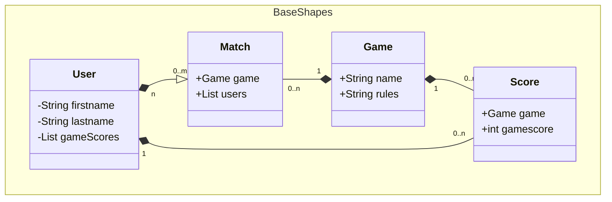

# gepardec-gamertrack

Lernprojekt für Juniors. Eine App für Tracking von Ergebnissen bei diversen sportlichen
Auseinandersetzungen

## Requirements

The following technologies are used by Gepardec-Gamertrack

1. `Java 23.x.x`
2. `WildFly 34.0.0.Final`
3. `Maven 3.4.x`
4. `H2-Database`
5. `Mockito`

## application.properties

The application needs the following variables set:

jboss.Home

e.g
> jboss.home=\${basedir}\${file.separator}..\${file.separator}wildfly

or any other wildfly location

## Build Project and deploy application

- *In order for all used relative paths to work  
  they should be executed from the projects root directory*
- *Use absolute path or relative path instead of $WILDFLY_HOME.*
    - *Alternatively set the environment variable with export WILDFLY_HOME=PATH/TO/WILDFLY/DIRECTORY
      for the current terminal session*

**Build**

```zsh 
  mvn clean install -am
```

**Start wildfly**

```zsh
  $WILDFLY_HOME/bin//wildfly-34.0.0.Final/bin/standalone.sh
```

**Deploy application to wildfly**

```zsh
  $WILDFLY_HOME/bin/jboss-cli.sh --connect --command="deploy --force ./gamertrack-war/target/gepardec-gamertrack.war"
```

**Undeploy and stop wildfly**

```zsh
  $WILDFLY_HOME/bin/jboss-cli.sh --connect --command="undeploy gepardec-gamertrack.war"
```

**Stop wildfly**

```zsh
  $WILDFLY_HOME/bin/jboss-cli.sh --connect --command="shutdown"
```

## Docker

When ```mvn clean install``` is executed an image with the application is generated and
automatically added to the existing docker environment

The docker image requires an already running postgres database which can be started with the
following command:

```bash
  docker run -d -p5432:5432 --name gamertrack-database -e POSTGRES_PASSWORD=gepardec -e POSTGRES_USER=gamertrack -e POSTGRES_DB=gamertrack postgres
```

Afterward the container with wildfly and the deployed application can be started as follows:

```bash
  docker run -p8080:8080 -e POSTGRESQL_USER=gamertrack -e POSTGRESQL_PASSWORD=gepardec -e POSTGRESQL_URL=jdbc:postgresql://10.254.100.58:5432/gamertrack gamertrack-war
```

## ER-diagram



## HTTPS-ENDPOINTS

Rest-Endpoints are available via

```http
 localhost:8080/gamertrack-war-1.0-SNAPSHOT/api/v1/
```

###

| Endpoint   | Description       |
|:-----------|:------------------|
| `/users`   | CRUD - operations |
| `/games`   | CRUD - operations |
| `/matches` | CRUD - operations |
| `/score`   | CRU - operations  |

For more specific information for each endpoint
visit: [OpenApi Spec](https://petstore.swagger.io/?url=https://raw.githubusercontent.com/Gepardec/gepardec-gamertrack/refs/heads/main/docs/openapi-spec.yaml)
