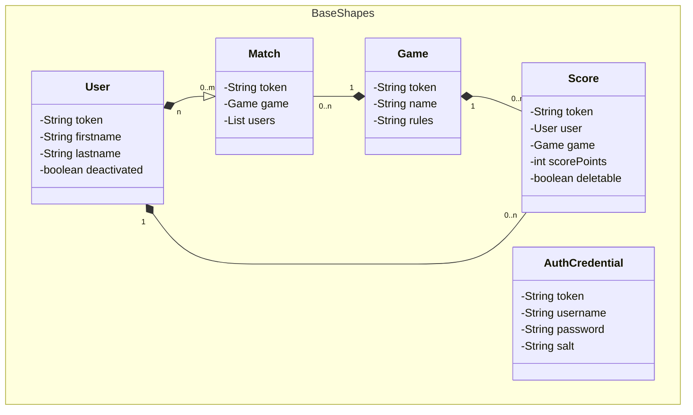

# gepardec-gamertrack

This is a learning project for Juniors. An app for tracking results of various sports competitions.

## Requirements

The following technologies are used by Gepardec-Gamertrack

1. `Java 23.x.x`
2. `WildFly 34.0.0.Final`
3. `Maven 3.4.x`
4. `H2-Database`
5. `Mockito`

## application.properties

The application needs the following variable set:

> ALLOWED_ORIGINS_AS_REGEX=^(http|https)://gamertrack-frontend.apps.cloudscale-lpg-2.appuio.cloud

## secret.env

The application needs a secret.env file located in the project root with the following variables set in order for 
authentication and tests to work. 

```
SECRET_ADMIN_NAME=
SECRET_JWT_HASH=
SECRET_DEFAULT_PW=
```
`SECRET_JWT_HASH` must be at least 64 chars long.

For convenience the [plugin](https://plugins.jetbrains.com/plugin/7861-envfile) is recommended for reading the secret.env when tests are executed via IntelliJ 

## Build Project and deploy application
**You can either use the built-in tools for Maven & WildFly in IntelliJ or use the following commands:**
- *In order for all used relative paths to work they should be executed from the projects root directory*

**Build**
*(This will also download the correct WildFly version into the project root)*
```zsh 
  mvn clean install -am
```

**Start wildfly**

```zsh
  wildfly/bin/standalone.sh
```

**Deploy application to wildfly**

```zsh
  wildfly/bin/jboss-cli.sh --connect --command="deploy --force ./gamertrack-war/target/gepardec-gamertrack.war"
```

**Undeploy and stop wildfly**

```zsh
  $WILDFLY_HOME/bin/jboss-cli.sh --connect --command="undeploy gepardec-gamertrack.war"
```

**Stop wildfly**

```zsh
  $WILDFLY_HOME/bin/jboss-cli.sh --connect --command="shutdown"
```


## ER-diagram



## HTTPS-ENDPOINTS

Rest-Endpoints are available via

```http
 localhost:8080/gamertrack-war-1.0-SNAPSHOT/api/v1/
```

###

| Endpoint    | Description       |
|:------------|:------------------|
| `/auth`     | login & validate  |
| `/health`   | App Health Status |
| `/users`    | CRUD - operations |
| `/games`    | CRUD - operations |
| `/matches`  | CRUD - operations |
| `/scores`   | CRU - operations  |
| `/ranklist` | Top Scores        |


For more specific information for each endpoint
visit: [OpenApi Spec](https://petstore.swagger.io/?url=https://raw.githubusercontent.com/Gepardec/gepardec-gamertrack/refs/heads/main/docs/openapi-spec.yaml)
